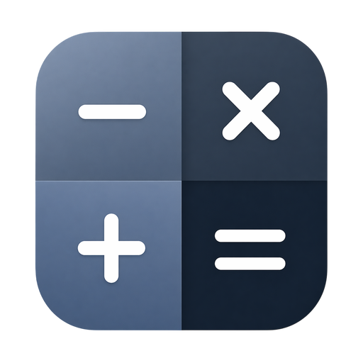

<div align="center">



<h1>Calculator Android</h1>

[](https://github.com/muhammad-fiaz/Calculator-Android/issues)
[](https://github.com/muhammad-fiaz/Calculator-Android/pulls)
[](https://github.com/muhammad-fiaz/Calculator-Android/graphs/contributors)
[](https://github.com/muhammad-fiaz/Calculator-Android/commits/main)
[](https://github.com/muhammad-fiaz/Calculator-Android/blob/main/LICENSE)
[](https://github.com/muhammad-fiaz/Calculator-Android/stargazers)

[](https://github.com/muhammad-fiaz)
[](https://github.com/muhammad-fiaz?tab=followers)
[](https://github.com/sponsors/muhammad-fiaz)
[](https://play.google.com/store/apps/details?id=dev.fiaz.calculator)


</div>

Calculator is your essential tool for all your mathematical needs. With a clean and user-friendly interface built with **Jetpack Compose** and **Material Design 3**, this app is designed to make both simple and complex calculations easy and efficient. Whether you're a student, professional, or just need quick calculations on the go, Calculator provides accurate results every time. Powered by modern Android technologies, it offers a smooth and reliable experience across all your Android devices. Simplify your math with Calculator!

## Features

### Calculator Modes
- **Standard Calculator**: Basic arithmetic operations with a clean, intuitive interface
- **Scientific Calculator**: Advanced mathematical functions including trigonometry, logarithms, powers, and more
- **Unit Converter**: Easily convert between different units (length, weight, volume, etc.)
- **Expression Parsing**: Supports complex expressions with proper precedence handling like `(1+1)*2/2+(8*8)`

### User Experience
- **Responsive Design**: Optimized for all screen sizes and orientations
- **Dark & Light Themes**: Beautiful themes that adapt to system preferences or manual selection
- **Calculation History**: Save, search, and replay past calculations
- **Material Design 3**: Modern UI following the latest design guidelines

### Technical Features
- **Jetpack Compose**: Modern declarative UI toolkit
- **Hilt Dependency Injection**: Clean architecture with dependency injection
- **Room Database**: Local storage for calculation history and settings
- **DataStore Preferences**: Persistent settings storage
- **Google Play Integrity API**: Enhanced security and fraud prevention
- **Google Play In-App Review**: Native review flow
- **Google Play App Updates**: Flexible and immediate update flows
- **State Management**: Efficient state management using ViewModel and StateFlow
- **Error Handling**: Robust error handling for invalid expressions
- **Performance Optimized**: Smooth animations and fast calculations
- **Server-less Architecture**: Purely local application with no external dependencies
- **Offline First**: Full functionality without internet connection
- **Privacy Focused**: No user data collection or external tracking

## Getting Started

### Prerequisites
- **Android Studio** (Ladybug | 2024.2.1 or later)
- **JDK 17** or higher
- **Android SDK** (API 37 / Android 14)
- **Kotlin 2.0+**

### Quick Setup

1. **Clone the repository**
   ```bash
   git clone https://github.com/muhammad-fiaz/Calculator-Android.git
   cd Calculator-Android
   ```

2. **Open in Android Studio**
   - File → Open → Select the project directory
   - Wait for Gradle sync to complete

3. **Configure Signing** (for release builds)
   - Create `app/signing.properties` (gitignored):
     ```properties
     storeFile=upload-keystore.jks
     storePassword=your-store-password
     keyAlias=your-key-alias
     keyPassword=your-key-password
     ```
   - Place your keystore at `app/upload-keystore.jks`

4. **Run the app**
   - Connect an Android device or start an emulator
   - Click **Run** ▶️ or press `Shift+F10`

### Build Commands

```bash
# Debug build
./gradlew assembleDebug

# Release build (signed)
./gradlew assembleRelease

# Build App Bundle (recommended for Play Store)
./gradlew bundleRelease

# Run tests
./gradlew test

# Run instrumented tests
./gradlew connectedAndroidTest

# Clean build
./gradlew clean
```

## Calculator Functions

### Standard Operations
- Basic arithmetic: `+`, `-`, `×`, `÷`
- Decimal numbers with proper validation
- Percentage calculations
- Parentheses for grouping: `(`, `)`

### Scientific Functions
- **Trigonometry**: `sin`, `cos`, `tan` (supports both radians and degrees)
- **Logarithms**: `ln` (natural log), `log` (base 10)
- **Powers**: `x²`, `x³`, `xʸ`, `√x`
- **Advanced**: `x!` (factorial), `1/x` (reciprocal)
- **Constants**: `π` (pi), `e` (Euler's number)

### Expression Examples
```
(2 + 3) × 4 = 20
sin(30°) = 0.5
log(100) = 2
2³ + √16 = 12
5! = 120
```

## Themes

### Light Theme
- Clean, bright interface
- High contrast for readability
- Material Design 3 color system

### Dark Theme
- Easy on the eyes
- Battery-friendly for OLED displays
- Consistent with system dark mode

### System Theme
- Automatically follows system settings
- Seamless transitions between modes

## History & Storage

### Calculation History
- **Persistent Storage**: All calculations saved locally using Room database
- **Search Functionality**: Find specific calculations quickly
- **Filter by Mode**: View standard or scientific calculations
- **Statistics**: Track usage patterns and calculation frequency

### Settings Persistence
- **DataStore Preferences**: Theme preference, angle mode (degrees/radians), etc.
- **Automatic Backup**: Settings survive app reinstalls

## Architecture

### Tech Stack
- **Language**: Kotlin 2.0+
- **UI**: Jetpack Compose with Material 3
- **Architecture**: MVVM with Clean Architecture principles
- **DI**: Hilt (Dagger)
- **Database**: Room (SQLite)
- **Preferences**: DataStore
- **Async**: Kotlin Coroutines & Flow
- **Navigation**: Navigation Compose

### Project Structure
```
app/src/main/java/dev/fiaz/calculator/
├── CalculatorApplication.kt      # Application class with Hilt
├── data/
│   ├── database/                 # Room database, DAOs, entities
│   ├── repository/               # Repository implementations
│   └── preferences/              # DataStore preferences
├── domain/
│   ├── model/                    # Domain models
│   ├── repository/               # Repository interfaces
│   └── usecase/                  # Business logic use cases
├── presentation/
│   ├── calculator/               # Calculator screen & ViewModel
│   ├── history/                  # History screen & ViewModel
│   ├── settings/                 # Settings screen & ViewModel
│   ├── theme/                    # Material 3 theming
│   └── common/                   # Shared UI components
└── di/                           # Hilt modules
```

### Key Components

| Component | Technology | Purpose |
|-----------|------------|---------|
| UI | Jetpack Compose | Declarative UI |
| DI | Hilt | Dependency injection |
| Database | Room | Local persistence |
| Preferences | DataStore | Key-value storage |
| Navigation | Navigation Compose | Screen navigation |
| Async | Coroutines/Flow | Reactive programming |

## Build & Deployment

### Android Signing Configuration

The project includes pre-configured Android signing for release builds:

1. **Keystore Location**: `app/upload-keystore.jks` (gitignored)
2. **Signing Properties**: `app/signing.properties` (gitignored for security)
3. **Configuration**: Automatically loaded in `app/build.gradle.kts`

#### Setting up Signing for Release

1. **Generate new keystore**:
   ```bash
   cd app
   keytool -genkey -v -keystore upload-keystore.jks -keyalg RSA -keysize 2048 -validity 10000 -alias upload
   ```

2. **Create signing.properties**:
   ```properties
   storeFile=upload-keystore.jks
   storePassword=your-store-password
   keyAlias=upload
   keyPassword=your-key-password
   ```

### Build Variants

| Variant | Description |
|---------|-------------|
| `debug` | Debug build, unsigned, minify disabled |
| `release` | Release build, signed, minify & shrink enabled |

### Deployment to Google Play Store

1. **Build App Bundle**:
   ```bash
   ./gradlew bundleRelease
   ```

2. **Upload to Play Console**:
   - Go to [Google Play Console](https://play.google.com/console/)
   - Create new release
   - Upload `app/build/outputs/bundle/release/app-release.aab`

3. **Configure Play Integrity** (already integrated):
   - Enable API in Google Cloud Console
   - Configure integrity tokens in Play Console

## App Icon & Branding

### Current Icon Configuration
The app uses the standard Android adaptive icon system. The icons are located at:
- **Play Store**: `app/src/main/playstore.png` (512x512px)
- **App Launcher**: Generated from `app/src/main/res/mipmap-*` directories

### Required Icon Files
Place the following files in the appropriate `res/mipmap-*` directories:
- **mdpi**: 48x48px
- **hdpi**: 72x72px
- **xhdpi**: 96x96px
- **xxhdpi**: 144x144px
- **xxxhdpi**: 192x192px
- **Play Store**: 512x512px (playstore.png)

### How to Update the Icon

1. **Replace icon files** in `app/src/main/res/mipmap-*/` directories
2. **Update playstore.png** for Play Store listing
3. **Regenerate adaptive icons** using Android Studio:
   - Right-click `res` → New → Image Asset
   - Select "Launcher Icons (Adaptive and Legacy)"
   - Choose your source asset

## Testing

### Running Tests

```bash
# Run unit tests
./gradlew test

# Run instrumented tests (requires device/emulator)
./gradlew connectedAndroidTest

# Run tests with coverage
./gradlew jacocoTestReport

# Run specific test class
./gradlew test --tests "dev.fiaz.calculator.CalculatorViewModelTest"
```

### Test Structure
```
app/src/test/                    # Unit tests (JVM)
├── data/
├── domain/
└── presentation/

app/src/androidTest/             # Instrumented tests (Android)
├── calculator/
├── history/
└── settings/
```

### Code Quality

```bash
# Run lint checks
./gradlew lint

# Run detekt (static analysis)
./gradlew detekt

# Format code with ktlint
./gradlew ktlintFormat

# Run all quality checks
./gradlew check
```

## Troubleshooting

### Common Issues

#### Build Issues

**Gradle Sync Fails**
```bash
# Clean and rebuild
./gradlew clean
./gradlew build --refresh-dependencies

# Invalidate caches in Android Studio
File → Invalidate Caches → Invalidate and Restart
```

**KSP/Kotlin Version Mismatch**
- Ensure `libs.versions.toml` has compatible versions
- Check `gradle.properties` for `kotlin.version`

**Hilt Compilation Errors**
```bash
# Clean KSP cache
./gradlew clean
rm -rf .gradle
./gradlew kspDebugKotlin
```

#### Runtime Issues

**App Crashes on Startup**
- Check logcat: `adb logcat`
- Verify Hilt modules are properly installed
- Check Room database migrations

**Database Issues**
- Clear app data to reset local database
- Check available storage space
- Verify database schema matches entities

### Debug Commands

```bash
# View device logs
adb logcat

# Install debug APK
adb install app/build/outputs/apk/debug/app-debug.apk

# Uninstall app
adb uninstall dev.fiaz.calculator

# Run with verbose output
./gradlew assembleDebug --info
```

### Performance Issues

- **Slow startup**: Check Hilt initialization, Room database creation
- **UI lag**: Profile with Android Studio Profiler
- **Memory issues**: Monitor with Memory Profiler
- **Battery drain**: Check for background coroutines

## Project Metrics

### Code Quality
- **Test Coverage**: Target >80%
- **Lint**: Zero warnings
- **Detekt**: Zero violations
- **Min SDK**: API 23 (Android 6.0)
- **Target SDK**: API 37 (Android 14)

### Performance
- **Startup Time**: <1.5 seconds (cold start)
- **Memory Usage**: <30MB (average)
- **APK Size**: ~5MB (release, compressed)
- **Smooth Animations**: 60 FPS target

### Security
- **Code Obfuscation**: R8/ProGuard enabled in release
- **Play Integrity**: Device verification
- **Secure Storage**: Encrypted SharedPreferences via DataStore
- **Network Security**: Cleartext traffic disabled

## Platform Support

- ✅ **Android** (API 23+ / Android 6.0+)
- ✅ **Phones** (all screen sizes)
- ✅ **Tablets** (responsive layouts)
- ✅ **Foldables** (adaptive layouts)
- ✅ **Chrome OS** (Android apps support)

## Contributing

We welcome contributions! Please see our [Contributing Guidelines](CONTRIBUTING.md) for details.

### Development Setup
1. Fork the repository
2. Create a feature branch: `git checkout -b feature/amazing-feature`
3. Commit your changes: `git commit -m 'Add amazing feature'`
4. Push to the branch: `git push origin feature/amazing-feature`
5. Open a Pull Request

### Code Style
- Follow [Kotlin Coding Conventions](https://kotlinlang.org/docs/coding-conventions.html)
- Use `ktlint` for formatting
- Use `detekt` for static analysis
- Write tests for new features
- Follow [Material Design 3](https://m3.material.io/) guidelines

## License

This project is licensed under the Apache License 2.0 - see the [LICENSE](LICENSE) file for details.

## Support

If you found this project helpful, please consider:
- ⭐ Starring the repository
- 🐛 Reporting bugs
- 💡 Suggesting new features
- 🤝 Contributing to the code

---

**Made with Kotlin & Jetpack Compose**